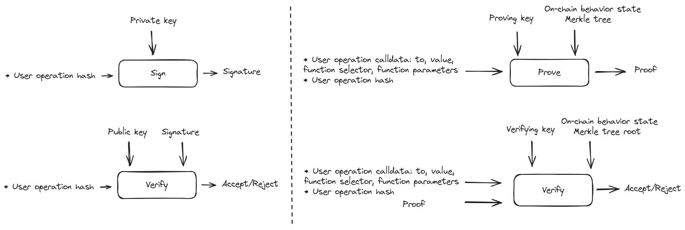
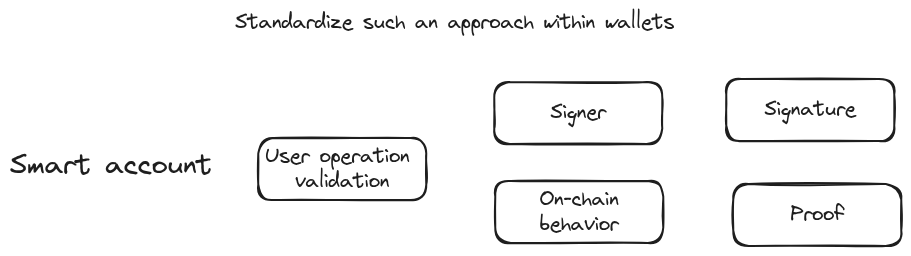
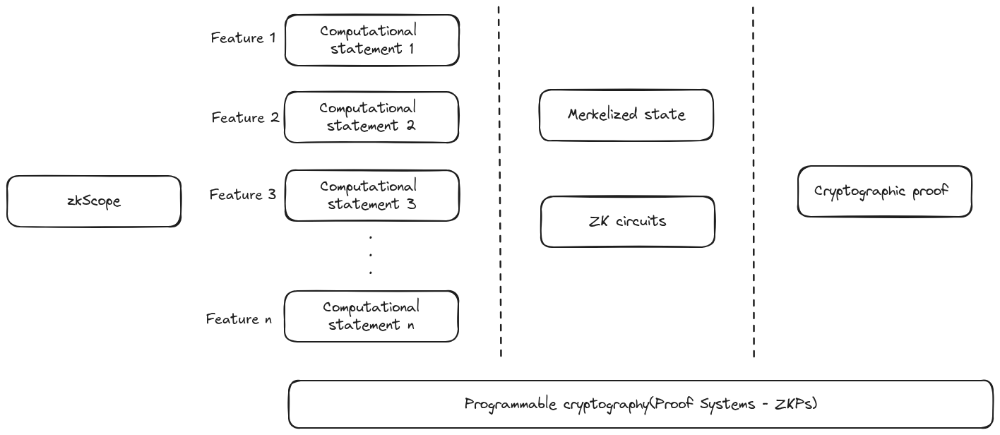
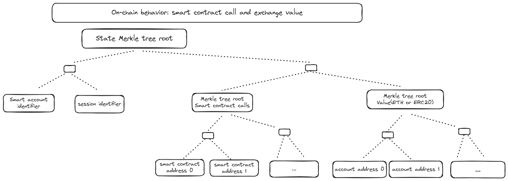
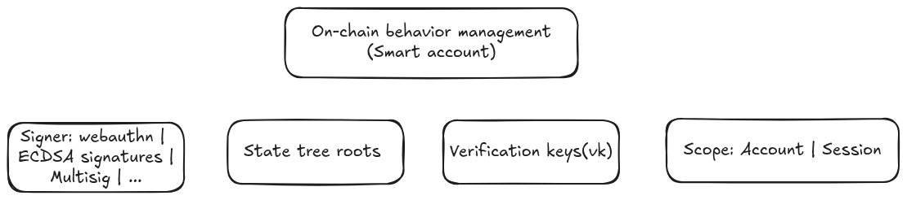
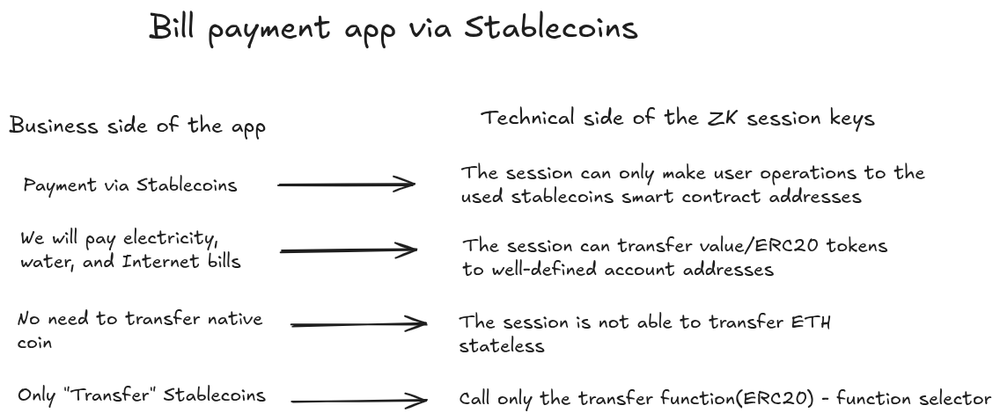
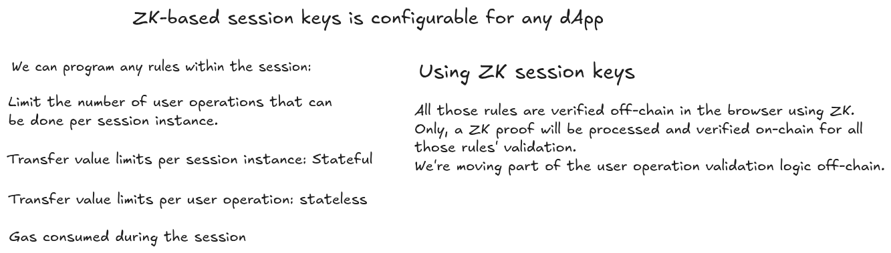
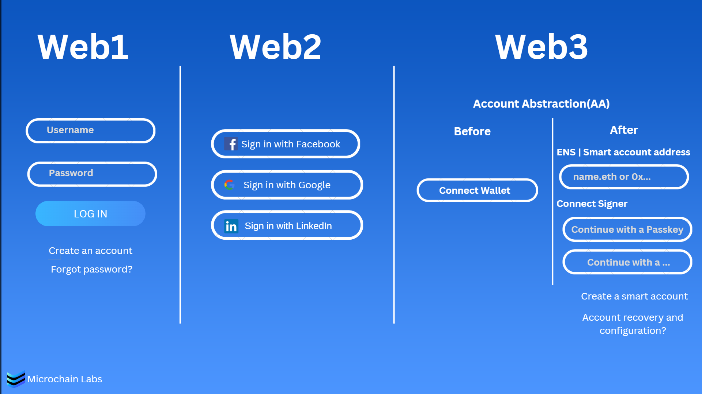

# zkScope-NoirHack


## Overview 

A Noir library for the account abstraction ecosystem.

At the hackathon, we're developing Noir circuits to secure, and control the on-chain behavior of smart accounts.

It enables a trust-minimized off-chain framework that secures and governs a smart account's on-chain behavior according to the user's preferences and intended actions.

## 📂 Project Structure

```
project-root/
├── circuits/   # Zero-knowledge circuits written in Noir: lib and main circuits that secures the on-behavior of a smart account
├── contracts/  # Smart account implementation 
├── js/         # JavaScript client and scripts interacting with circuits 
└── ...
```

## 🧩 Circuits Library Overview

- **circuits/** — Zero-knowledge circuits written in Noir.
  - **zkScope_lib/** — Reusable components and utility circuits:
    - `contract_value_whitelist.nr`: [A circuit that verifies whether a smart account interaction targets an approved contract address and transfers value (native or ERC-20) to an approved recipient address]
    - `gas_usage.nr`: [A circuit that governs the gas usage behavior of a smart account]
    - `utils.nr`: Helper functions for other circuits
  - `session_keys_demo`: [A main circuit leveraging zkScope_lib within a session key use case]
  - `spending_permission_note | add_spending_permission_notes`: [Main circuits: enable a smart account to define off-chain permission notes that authorize an app, trading bot, or AI agent to spend ERC-20 tokens on the user's behalf]

## A new paradigm for validating transactions/user operations by the Blockchain
We’re familiar with validating transactions/user operations based on different types of signers and signing algorithms, such as  ECDSA, Passkey (WebAuthn), and multisig. Today, most accounts, including externally owned accounts(EOAs) and smart accounts, are controlled via signers. So, the Blockchain is configured to only trust the signer: it will validate and accept a transaction based on providing a valid signature.


We’re introducing a new approach to control an account using a signer and the user's intended on-chain behavior. In such a configuration, the Blockchain will validate a transaction based on a signer and a proof that validates that the transaction behavior is compliant with the user-defined on-chain behavior. So, the blockchain will trust a new trust-minimized framework that lets him familiarize himself with the account's intended on-chain behavior. 
 

All wallets rely on public-key cryptography, which provides cryptographic services over data—this is a form of purpose-specific cryptography. In recent years, we've entered a new era: cryptographic services over computation, also known as general-purpose or programmable cryptography, have emerged—driven especially by zero-knowledge proofs (ZKPs) and fully homomorphic encryption (FHE). As account abstraction (AA) evolves, wallets will increasingly integrate programmable cryptography as a native capability.
 

## ZK Apps for smart accounts

For any feature around securing and controlling the account's on-chain behavior:
* Define and put the state into a Merkle tree
* Program the feature business logic using Noir circuit.


On-chain behavior: smart contract call and exchange value



On-chain behavior management within a smart account: 



## Integration and Use cases
1) The Bybit attack is an alert for missing a strong security guarantee for smart accounts that hold an important amount of value.
Using zkScope, we will add a new security layer to the existing Safe accounts that provide strong security guarantees around the accounts' on-chain behavior(technically, via safe handler).
In general, it will be integrated into any smart accounts: ERC-4337/ERC-7579 and EIP-7702 compliant accounts.

2) [Smart session](https://github.com/erc7579/smartsessions/tree/main): Session keys are scoped (i.e., restricted to certain on-chain actions), only valid for a pre-determined period, and authorized by the user. For example, a session key can be limited to only approve USDC transfers under a certain value to a whitelist of addresses for the next hour. They are a useful tool for making general UX improvements but can also unlock powerful new use cases that require delegating high-stakes access rights to a trusted entity like an AI agent or trading bot..
For production, Smart Session is an ERC-7579 module created by Rhinestone and Biconomy. It only supports on-chain programmable permission. With zkScope, we will integrate off-chain programmable persimmon into the module. In the hackathon, we built a seamless on-chain experience with session keys using Noir.

3) Spending permission notes for smart accounts: enable apps, AI agents, or trading bots to spend native and ERC-20 tokens on behalf of users.

4) zkScope integration into diferent account abstraction(AA) ecosystem such as Starknet(Garaga SDK).

5) Smart accounts for enterprises and employees: Prove with ZK that an employee's transactions are compliant with the enterprise governance rules.

## Demo
The purpose of this demo is to showcase how zkScope is making the on-chain experience more user-friendly (web2-like experience). It is an end-to-end example of using Noir circuits to secure and control the on-chain behavior of a smart account via ZK-based session keys.

Session keys are scoped (i.e., restricted to certain on-chain actions), only valid for a pre-determined period, and authorized by the user. For example, a session key can be limited to only approve USDC transfers under a certain value to a whitelist of addresses for the next hour. They are a useful tool for making general UX improvements.

dApp demo: a simple application for paying bills via stablecoins. We can use ZK-based session keys for any dApp.

 

 

Set up:

1) Clone the project and enter “session-keys-Demo-UI” folder
2) yarn install
3) Get your api key from: https://dashboard.pimlico.io/sign-in
4) Add in .env file your pimlico api key: NEXT_PUBLIC_PIMLICO_API_KEY=your_api_key
5) The demo is configured within the Polygon network. We must create three fake ERC20 tokens representing stablecoins: USDT, USDC, and DAI. You can use https://wizard.openzeppelin.com/#erc20 and remix to deploy them. 
6) We need to set the fake ERC20 addresses in the project. In the file “components/constants.ts”, put the three deployed ERC20 addresses.
7) yarn dev

Create new smart account:


https://github.com/user-attachments/assets/a3bcd4b7-6821-4306-b8eb-9fdc9795e0b3


Create new ZK-based smart session:


https://github.com/user-attachments/assets/bf649e9a-c175-4ed8-a9dc-536037cfa4fe


Bills payments:


https://github.com/user-attachments/assets/e1b6c2d8-667a-4c2a-8e29-83215edaa23e


Web1 vs. Web2 vs. Web3 Login:

 